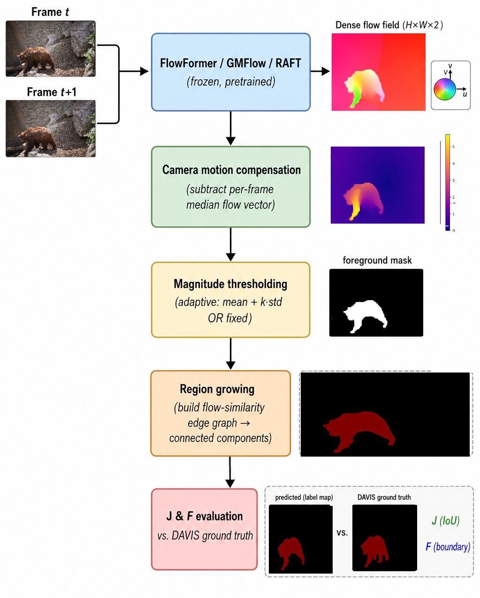
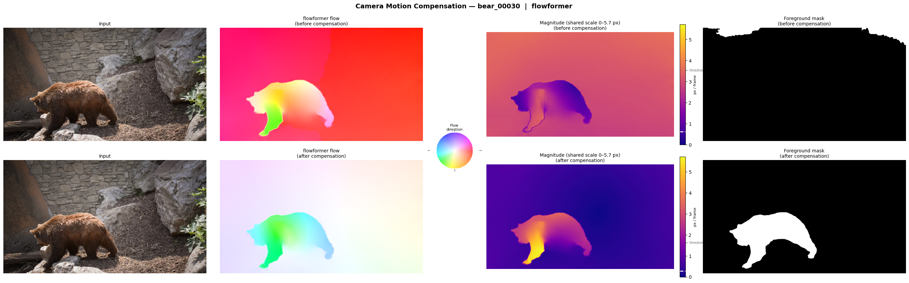
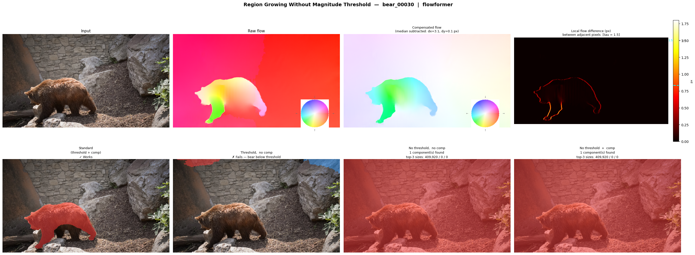

# YZV416E-PixelDynamics


A Computer Vision project focused on Video Object Segmentation leveraging motion cues and region growing techniques.

## Overview

This project aims to perform accurate motion-based segmentation on video sequences, specifically targeting the **DAVIS (Densely-Annotated Video Segmentation) dataset**. By integrating optical flow features with classical computer vision algorithms, we aim to robustly segment moving objects from their backgrounds.

The core pipeline utilizes **FlowFormer** for high-quality optical flow extraction. These extracted motion cues are then used to seed and guide a **Region Growing** algorithm to produce precise object masks.

## Pipeline



## Camera Motion Compensation

On tracking-camera sequences the subject appears nearly stationary in the raw optical flow while the background dominates with large magnitude. Without compensation the subject falls below the foreground threshold and is never detected. With compensation the background motion is removed, the subject's residual motion stands out, and the foreground mask correctly isolates it. The visualisation below shows this effect on the bear sequence (frame 00030).



## No-Threshold Experiment

Comparison of segmentation variants when the magnitude threshold is removed, alongside a local flow-difference map explaining why smooth learned flow boundaries prevent region growing from separating objects without the magnitude gate.



## Features

- **High-Fidelity Optical Flow:** Integration with FlowFormer to extract dense, accurate motion fields between video frames.
- **Motion-Based Region Growing:** Custom implementation of a region growing algorithm that propagates based on optical flow similarities rather than just color or intensity.
- **DAVIS Dataset Support:** Data loaders and evaluation scripts specifically tailored for the DAVIS dataset benchmarks.

## Project Structure

```
YZV416E-PixelDynamics/
├── assets/             # Images used in this README (pipeline diagram, visualizations)
├── data/               # DAVIS dataset and extracted flow fields
├── models/             # Flow backbone repositories and checkpoints
├── notebooks/          # Jupyter notebooks for experimentation and EDA
├── results/            # Generated masks, evaluation CSVs, visualization outputs
├── scripts/            # All pipeline scripts
│   ├── region_growing.py           # Region growing algorithm
│   ├── flow_extraction.py          # RAFT flow extraction
│   ├── run_flowformer.py           # FlowFormer flow extraction
│   ├── gmflow_extraction.py        # GMFlow flow extraction
│   ├── evaluate.py                 # J & F evaluation
│   ├── run_pipeline.py             # End-to-end pipeline runner
│   ├── run_ablations.py            # Ablation grid
│   ├── visualize_camera_compensation.py
│   ├── visualize_no_threshold.py
│   ├── download_davis.sh           # Dataset download
│   ├── setup_raft.sh               # RAFT setup
│   └── setup_flowformer.sh         # FlowFormer setup
├── requirements.txt
└── README.md
```

## Setup & Installation

1. **Clone the repository:**
   ```bash
   git clone <repository_url>
   cd YZV416E-PixelDynamics
   ```

2. **Create a virtual environment (optional but recommended):**
   ```bash
   python -m venv venv
   source venv/bin/activate  # On Windows, use `venv\Scripts\activate`
   ```

3. **Install dependencies:**
   ```bash
   pip install -r requirements.txt
   ```

## Dataset

Download the DAVIS 2017 Unsupervised dataset (~2 GB) using the provided script:

```bash
bash scripts/download_davis.sh
```

This downloads and extracts the dataset into `data/DAVIS/`. The folder structure will be:

```
data/DAVIS/
├── JPEGImages/480p/        # RGB frames
├── Annotations_unsupervised/480p/  # Ground-truth masks
└── ImageSets/2017/         # train.txt / val.txt split files
```

---

## Model Setup

### RAFT

```bash
bash scripts/setup_raft.sh
```

This clones the RAFT repository into `models/RAFT/` and downloads the pretrained checkpoints automatically.

### FlowFormer

```bash
bash scripts/setup_flowformer.sh           # downloads things.pth (default, recommended)
```

This clones the FlowFormer repository into `models/FlowFormer/` and downloads the selected checkpoint. Requires `gdown` (`pip install gdown`).

### GMFlow

There is no setup script for GMFlow. Clone it manually:

```bash
git clone https://github.com/haofeixu/gmflow.git
```

Place the cloned folder at the project root so it is accessible as `gmflow/`.

---

## Flow Extraction

> **Warning:** Extracting optical flow for the full DAVIS val split is a time-consuming process. Expect **5–6 hours** on a mid-range GPU and approximately **20 GB** of disk space for the generated `.npy` files.
>
> Pre-extracted flow files are available on Google Drive: **[LINK — TBD]**
> Download and place them under `data/flow/` to skip extraction entirely.

### RAFT

```bash
python scripts/flow_extraction.py --sequences val
```

Output: `data/flow/raft/<sequence>/<frame>.npy`

### FlowFormer

```bash
python scripts/run_flowformer.py --sequences val
```

Output: `data/flow/flowformer/<sequence>/<frame>.npy`

### GMFlow

```bash
python scripts/gmflow_extraction.py --sequences val
```

Output: `data/flow/gmflow/<sequence>/<frame>.npy`

For any backbone, replace `val` with a comma-separated list to run on specific sequences only:

```bash
python scripts/flow_extraction.py --sequences bear,dog,camel
```

---

## Running the Pipeline

Once flow is extracted, the rest of the pipeline runs on CPU and is fast.

### 1. Region Growing — Generate Masks

```bash
python scripts/region_growing.py \
    --flow-root data/flow/flowformer \
    --out-root results/flowformer_rg \
    --sequences val
```

Replace `--flow-root` with `data/flow/raft` or `data/flow/gmflow` to use a different backbone. Results are saved as DAVIS-palette PNG masks under `results/<method>/<sequence>/<frame>.png`.

### 2. Evaluation — Compute J & F

```bash
python scripts/evaluate.py \
    --pred results/flowformer_rg \
    --sequences val \
    --csv results/flowformer_rg.csv
```

Prints per-sequence J, F, J&F and mean across all sequences. Pass `--csv <path>` to also save a CSV.

### 3. One-Command Pipeline

To run flow extraction → region growing → evaluation in a single command:

```bash
python scripts/run_pipeline.py --sequences bear
```

### 4. Ablation Studies

To run a grid of region growing configurations and compare them:

```bash
python scripts/run_ablations.py \
    --flow-root data/flow/flowformer \
    --sequences val \
    --out results/ablations.csv
```

This evaluates 20 configurations (camera compensation, threshold mode, τ, connectivity, smoothing) and writes one CSV row per configuration.

### 5. Visualizations

**Camera motion compensation effect** — shows raw flow, compensated flow, magnitude heatmaps with threshold marked, and resulting foreground masks side by side for before/after compensation:

```bash
python scripts/visualize_camera_compensation.py --sequence bear
python scripts/visualize_camera_compensation.py --sequence bear --frame 00030   # single frame
```

Output: `results/camera_compensation_viz_<sequence>/`

---

**No-threshold experiment** — compares four segmentation variants (standard, threshold only, no threshold without compensation, no threshold with compensation) alongside a local flow-difference map that explains why removing the magnitude threshold does not work with smooth learned flow fields:

```bash
python scripts/visualize_no_threshold.py --sequence bear
python scripts/visualize_no_threshold.py --sequence bear --frame 00030   # single frame
```

Output: `results/no_threshold_viz_<sequence>/`

---

## Key Configuration Options

The region growing algorithm is controlled by `RegionGrowingConfig` in `scripts/region_growing.py`. The most important flags exposed on the CLI:

| Flag | Default | Description |
|---|---|---|
| `--threshold-mode` | `adaptive` | `adaptive` (mean + k·std) or `fixed` |
| `--seed-k` | `1.0` | k multiplier for adaptive threshold |
| `--tau` | `1.5` | Max flow-vector difference to merge neighbours (px) |
| `--smooth-sigma` | `1.0` | Gaussian blur sigma on flow (0 = off) |
| `--compensate-camera` / `--no-compensate-camera` | on | Subtract background flow before processing |
| `--compensate-mode` | `median` | `median` or `homography` (RANSAC-based) |
| `--min-area` | `200` | Minimum region size in pixels |
